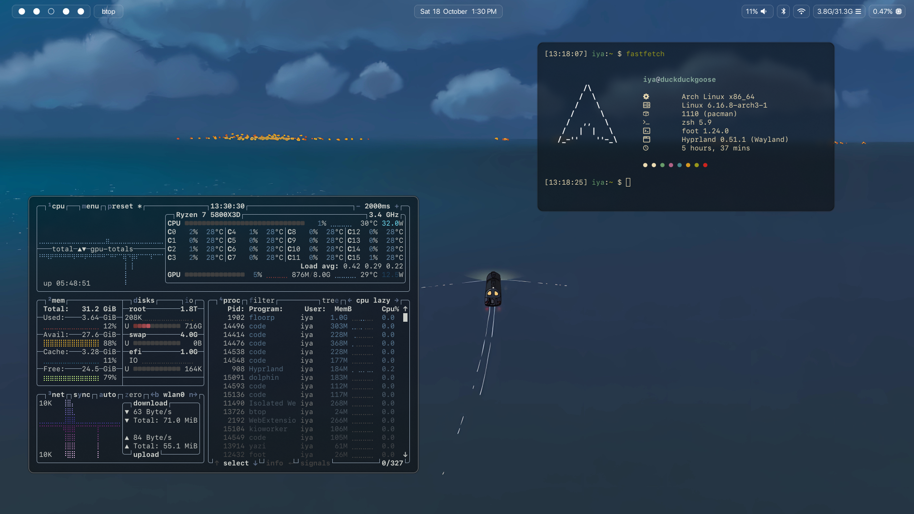

# Arch dotfiles
" alt="No face eating" width=500>
It's a simple undercooked rice for now, and I take inspirations from people in the web :>

 
  <a href="#packages"><kbd>   Packages   </kbd></a>&ensp;&ensp;
  <a href="#showcase"><kbd>   Showcase   </kbd></a>&ensp;&ensp;

## Packages
list of main programs, applications, tools and themes that I use for my rice
| component           | resource  
| :---------          | :-------  
| window manager      | [hyprland](https://github.com/hyprwm/Hyprland)
| terminal emulator   | [foot](https://wiki.archlinux.org/title/Foot)
| shell               | [zsh](https://github.com/ohmyzsh)
| resource monitor    | [btop](https://github.com/aristocratos/btop)
| bar                 | [waybar](https://github.com/Alexays/Waybar)
| logout menu         | [wlogout](https://github.com/ArtsyMacaw/wlogout)
| lockscreen          | [hyprlock](https://github.com/hyprwm/hyprlock)
| idle daemon         | [hypridle](https://github.com/hyprwm/hypridle)
| app launcher        | [wofi](https://hg.sr.ht/~scoopta/wofi)
| wallpaper daemon    | [hyprpaper](https://archlinux.org/packages/extra/x86_64/hyprpaper/)
| screenshot tool     | [grim](https://man.archlinux.org/man/grim.1.en) & [swappy](https://man.archlinux.org/man/swappy.1.en)
| font                | [SanFrancisco](https://github.com/thelioncape/San-Francisco-family)

## Showcase

